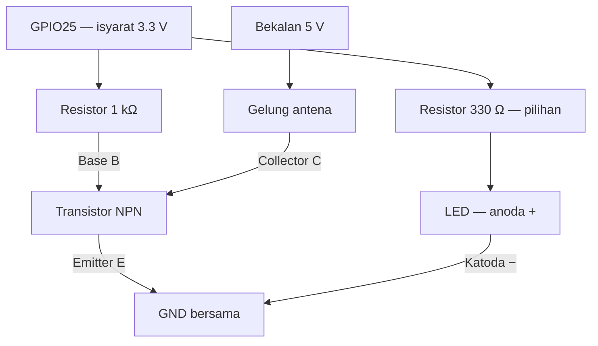

<p align="center">
  
</p>

<h1 align="center">MB6 TimeSync</h1>

<p align="center"><strong>G-SHOCK · MULTI BAND 6 · ESP32 · JJY 60 kHz</strong></p>

**Pemancar penyegerak masa 60 kHz berasaskan ESP32 untuk jam Casio yang menyokong penerimaan JJY.**

MB6 TimeSync mendapatkan masa melalui Wi-Fi dan NTP SIRIM, kemudian menjana isyarat masa gaya JJY melalui gelung antena. Projek ini menyediakan paparan OLED, kawalan melalui pelayar web dan pancaran berjadual untuk kegunaan jarak dekat.

Nama repositori: `mb6-timesync`.

README ini menerangkan konfigurasi projek dengan jadual firmware v0.4.1 dan litar transistor 2N2222 yang digunakan dalam prototaip. Litar perkakasan masih memerlukan pengesahan arus gelung dan perlindungan lonjakan sebelum dianggap reka bentuk lengkap.

## Ciri utama

- Pembawa nominal **60 kHz** melalui GPIO25.
- Masa daripada `ntp1.sirim.my` dan `ntp2.sirim.my`.
- OLED I2C **1.3 inci, 128 × 64**, menggunakan pemacu SH1106 dan pustaka Adafruit SH110X.
- Paparan masa Malaysia, status Wi-Fi/NTP, mod operasi, status TX, alamat IP dan jadual seterusnya.
- Ikon Wi-Fi, masa/NTP dan antena pada OLED.
- Web UI untuk pancaran manual, Auto ON/OFF, Stop TX dan permintaan NTP.
- Pancaran **manual 10 minit** dan **auto 8 minit** setiap sesi.
- Tetapan Auto disimpan melalui Preferences.
- Kawalan tambahan melalui Serial Monitor.
- TX ditahan apabila masa NTP belum sah atau sudah melebihi had usia firmware.

> `NTP:OK` bermaksud ESP32 menerima masa rangkaian. `TX:FRAME` bermaksud firmware sedang menjana bingkai pancaran. Kedua-duanya bukan pengesahan bahawa jam berjaya sync; semak keputusan penerimaan pada jam sendiri.

## Perkakasan

| Bil | Komponen / Peralatan | Spesifikasi & Nilai | Fungsi Utama dalam Projek |
| --- | --- | --- | --- |
| **1** | **Mikropengawal** | ESP32 Development Board, 30-Pin NodeMCU ESP-WROOM-32 | Otak projek; mendapatkan masa NTP dan menjana pembawa 60 kHz serta denyutan kod masa melalui D25 / GPIO25. |
| **2** | **ESP32 Extension Board** | Expansion Board 30-Pin / Breakout Shield yang sepadan dengan ESP32 | Memudahkan sambungan VCC, GND, D25, D21 dan D22 ke donut board dan OLED tanpa pateri terus ke ESP32. |
| **3** | **Transistor NPN** | 2N2222; gunakan fungsi kaki E, B dan C mengikut datasheet unit sebenar | Suis elektronik pada bahagian GND gelung; mengawal arus gelung yang dibekalkan 5 V menggunakan isyarat 3.3 V ESP32. |
| **4** | **Gelung Antena** | Gelung dawai tembaga halus berlapis enamel; digunakan pada pembawa 60 kHz | Memancarkan medan magnet isyarat masa gaya JJY. Jarak sekitar 1 meter ialah anggaran ujian pengguna dan bergantung pada setup; resonans gelung belum diukur. |
| **5** | **Resistor (Transistor)** | 1 kΩ | Mengehadkan arus dari D25 ke Base (B) transistor; tidak mengehadkan arus gelung secara langsung. |
| **6** | **LED Indikator** | LED biasa, merah atau biru | Menunjukkan aktiviti isyarat D25 mengikut sampul denyutan kod masa; bukan pengesan RF atau pengesahan sync jam. |
| **7** | **Resistor (LED)** | 330 Ω; 220 Ω sebagai pilihan selepas semakan arus LED dan beban GPIO | Mengehadkan arus dalam cabang LED. Nilai 330 Ω digunakan dalam rajah dan panduan pemasangan ini. |
| **8** | **Papan Litar (Prototyping)** | Papan donut / perfboard dengan pad berasingan | Tapak untuk menyusun dan memateri transistor, resistor, LED dan terminal secara kekal. |
| **9** | **Klip Penyambung Antena** | Screw Terminal Block 2-Pin, biru | Memudahkan pemasangan dan penanggalan dua hujung antena menggunakan skru. |
| **10** | **Wayar Penyambung** | Solid-core jumper wire untuk laluan papan; kabel Dupont dengan hujung yang sepadan untuk header | Membina sambungan donut board, percabangan D25 dan sambungan ke extension board. |
| **11** | **Skrin Paparan** | OLED SH1106 1.3 inci, I2C: D21 SDA dan D22 SCL; bekalan 3.3 V | Memaparkan masa, status NTP, mod operasi dan status pemancar. |

Bekalan sistem ialah **USB 5 V**. Pilih expansion board dengan bilangan pin, jarak soket dan susunan pin yang benar-benar sepadan dengan ESP32; jangan paksa board yang tidak sepadan ke soket.

**Catatan pinout:** jika transistor sebenar telah disahkan E–B–C apabila permukaan rata menghadap anda dan kaki ke bawah, gunakan susunan itu. Nama “2N2222” sahaja tidak menjamin urutan E–B–C bagi semua pengeluar atau varian.

ESP32 klasik menggunakan Wi-Fi **2.4 GHz**. Sambungkan kepada rangkaian 2.4 GHz atau SSID gabungan yang menyediakan jalur tersebut.

## Sambungan pin

### OLED

| Pin OLED | Sambungan |
| --- | --- |
| VCC | 3.3 V |
| GND | GND bersama |
| SDA | GPIO21 / D21, pin isyarat S |
| SCK / SCL | GPIO22 / D22, pin isyarat S |

Firmware mencuba alamat I2C `0x3C` dan `0x3D`. Dalam setup ini, jumper VCC expansion board kekal pada **3.3 V** untuk OLED. Bekalan 5 V gelung diambil daripada pin **5 V tetap**, bukan daripada baris VCC yang dipilih jumper.

### Pemacu gelung dengan transistor

| Dari | Ke |
| --- | --- |
| GPIO25 / D25, pin S | Resistor 1 kΩ |
| Hujung resistor 1 kΩ yang lain | Base transistor, B |
| Emitter transistor, E | GND bersama |
| Collector transistor, C | Hujung kedua gelung |
| Hujung pertama gelung | Bekalan 5 V tetap |
| GND bekalan 5 V | GND ESP32 |



Rajah ini menunjukkan **hubungan elektrik**, bukan kedudukan atau urutan kaki fizikal transistor. Semak nombor penuh, pengeluar dan datasheet unit yang digunakan; transistor berlabel PN2222A dan P2N2222A boleh mempunyai urutan kaki berbeza.

LED pilihan menunjukkan aktiviti GPIO25. Ia tidak mengukur kekuatan pancaran atau keputusan sync jam. Resistor 330 Ω berada dalam cabang LED sahaja.

### Had litar prototaip

Resistor 1 kΩ pada Base **tidak mengehadkan arus gelung secara langsung**. Gelung ialah beban induktif dan boleh menghasilkan lonjakan voltan apabila transistor dimatikan. Litar di atas mendokumentasikan prototaip; pengukuran arus, suhu transistor dan bentuk gelombang Collector masih diperlukan untuk menentukan had arus serta perlindungan yang sesuai pada 60 kHz.

Gunakan satu sumber USB dalam setup ini. Jangan sambungkan 5 V kepada GPIO ESP32. Cabut kuasa sebelum mengubah pendawaian atau membuat kerja pateri.

## Panduan pemasangan donut board

Panduan ini memindahkan sambungan prototaip ke perfboard. **Setiap pad donut berasingan**; lubang bersebelahan tidak bersambung secara automatik. Gunakan pateri untuk sambungan dekat dan wayar pendek berpenebat untuk sambungan jauh atau laluan yang bersilang.

Tetapkan dua terminal antena sebagai **T1 = 5 V** dan **T2 = Collector**. Ini ialah label projek yang perlu ditanda pada papan, bukan nombor wajib pada terminal komersial. Semua kerja pematerian dibuat dengan USB dicabut.

### Fasa 1: Pematerian komponen pada donut board

1. **Pasang screw terminal block, klip biru.**

   Letakkan terminal 2-pin di tepi papan supaya skru mudah dicapai. Pastikan jarak pin sepadan dengan lubang sebelum memateri kedua-dua kaki. Tanda T1 dan T2.

2. **Pasang transistor 2N2222.**

   Kenal pasti Emitter (E), Base (B) dan Collector (C) mengikut datasheet unit sebenar. Letakkan transistor di kawasan tengah papan dengan ruang untuk sambungan. Susunan kiri E, tengah B, kanan C hanya digunakan apabila pinout itu telah disahkan.

3. **Pasang resistor 1 kΩ, laluan Base.**

   Letakkan kaki pertama resistor pada titik input D25. Sambungkan kaki kedua resistor ke **Base (B)** dengan pateri atau wayar pendek. Meletakkan kaki pada lubang bersebelahan sahaja tidak membuat sambungan.

4. **Pasang resistor 330 Ω dan LED, laluan indikator.**

   Letakkan kaki pertama resistor pada titik input D25. Sambungkan kaki kedua ke **anoda (+)** LED. Pada LED baharu, anoda biasanya kaki panjang; katoda biasanya kaki pendek dan sisi badan yang rata. Jika kaki sudah dipotong, sahkan polariti menggunakan datasheet atau mod diode multimeter.

5. **Bina percabangan isyarat D25.**

   Di sisi pateri, cantumkan **wayar input D25**, **kaki pertama resistor 1 kΩ** dan **kaki pertama resistor 330 Ω** pada satu titik elektrik yang sama. Jangan cantumkan titik ini terus ke Base tanpa resistor.

6. **Bina sambungan GND bersama.**

   Cantumkan **katoda (−) LED**, **Emitter (E)** dan **wayar GND ESP32**. Gunakan wayar penghubung jika titik-titik itu berjauhan; elakkan timbunan timah yang mudah menyentuh pad lain.

7. **Sambungkan Collector ke terminal antena.**

   Cantumkan **Collector (C)** ke **T2**. T2 menerima hujung kedua gelung.

8. **Bina titik bekalan 5 V antena.**

   Cantumkan **T1** ke **wayar bekalan 5 V tetap** daripada papan. Pastikan sambungan ini terasing daripada D25, Base dan laluan GND.

### Fasa 2: Sambungan antena dan perkakasan luar

9. **Pasang dua hujung gelung pada terminal block.**

   Bersihkan lapisan enamel pada kedua-dua hujung tembaga hingga sentuhan elektrik baik. Longgarkan skru, masukkan **hujung 1 ke T1 (5 V)** dan **hujung 2 ke T2 (Collector)**, kemudian ketatkan. Pastikan wayar dikapit kukuh dan tiada tembaga terdedah yang bersentuh antara terminal.

10. **Tentukan panjang wayar penyambung.**

    Potong wayar mengikut kedudukan sebenar papan dan sediakan sedikit ruang untuk membengkok. Gunakan wayar solid-core untuk laluan pada donut board. Untuk header jantan extension board, gunakan penyambung female yang sesuai; jangan bergantung pada wayar kosong yang dicucuk longgar ke header.

### Fasa 3: Sambungan ESP32, extension board dan OLED

11. **Dudukkan ESP32 pada extension board.**

    Dengan kuasa diputuskan, sejajarkan semua pin dan orientasi board dengan soket. Tekan perlahan serta sekata. Pastikan tiada pin tersasar satu lubang atau terlipat.

12. **Sambungkan tiga wayar donut board.**

    | Wayar | Sambungan pada extension board |
    | --- | --- |
    | D25 | Pin **S** pada baris **D25**, lazimnya baris isyarat kuning |
    | GND | Pin **G** pada baris D25 atau mana-mana GND bersama, lazimnya baris hitam |
    | 5 V | Pin atau terminal **5 V tetap** |

    Ikut label sebenar papan, bukan warna sahaja. Jumper VCC kekal **3.3 V** untuk OLED; jangan ambil bekalan gelung daripada VCC yang telah dipilih 3.3 V.

13. **Pasang OLED I2C.**

    | Pin OLED | Pin extension board |
    | --- | --- |
    | VCC | VCC yang telah disahkan 3.3 V, atau pin 3V3 tetap |
    | GND | GND bersama |
    | SDA | D21, pin isyarat S |
    | SCL / SCK | D22, pin isyarat S |

    Jika D21/D22 tersedia di lebih daripada satu header, rujuk label pin isyarat dan sambungan papan. Jangan sambungkan SDA/SCL ke baris VCC atau GND.

### Fasa 4: Pemeriksaan dan pengujian

14. **Semak sambungan menggunakan multimeter.**

    Dengan USB dicabut, semak keterusan setiap laluan yang sepatutnya bersambung: T1 ke bekalan 5 V, T2 ke Collector dan GND ke Emitter/katoda LED. Semak sambungan D25 ke kaki pertama kedua-dua resistor serta hujung resistor ke Base/anoda LED.

    Periksa juga tiada jambatan pateri terus antara **5 V, GND dan D25**. Bacaan melalui resistor atau semikonduktor tidak semestinya bermaksud litar pintas; periksa laluan dan gunakan mod rintangan/diode apabila perlu. Ukur bekalan 3.3 V dan 5 V menggunakan **mod voltan DC**, bukan mod keterusan pada litar berkuasa.

15. **Uji kuasa dan operasi.**

    Gunakan satu kabel USB pada ESP32 atau input kuasa extension board yang sesuai. Semak OLED menyala, Wi-Fi tersambung dan NTP sah. Aktifkan **Manual TX**, tunggu minit penuh seterusnya dan perhatikan penunjuk TX serta LED.

    Kelipan yang kelihatan mengikuti **sampul denyutan kod masa**; mata tidak dapat melihat pembawa 60 kHz secara langsung. Untuk LED biru, nyalaan boleh lebih malap kerana voltan hadapannya. Semak keputusan sync pada jam sendiri. Jika transistor panas atau kuasa tidak stabil, hentikan ujian dan semak arus gelung serta litar pemacu.

## Perisian dan pemasangan

Gunakan Arduino IDE dengan:

- Pakej **esp32 by Espressif Systems**, siri **3.x** untuk firmware v0.4.1 yang dirujuk.
- **Adafruit GFX Library**.
- **Adafruit SH110X**.
- **Adafruit BusIO**, jika diminta sebagai dependency.

`WiFi`, `WebServer`, `Wire` dan `Preferences` disediakan bersama pakej ESP32. Firmware ini menggunakan API LEDC siri 3.x; pakej ESP32 2.x tidak sesuai untuk kod tersebut.

1. Buka fail `.ino` firmware projek dalam Arduino IDE. Nama folder sketch perlu sama dengan nama fail `.ino` utamanya.
2. Pilih board ESP32 klasik yang sepadan, contohnya **ESP32 Dev Module**, serta port USB yang betul.
3. Masukkan SSID dan kata laluan Wi-Fi menggunakan nilai sendiri:

   ```cpp
   constexpr char WIFI_SSID[] = "NAMA_WIFI_2_4GHZ";
   constexpr char WIFI_PASSWORD[] = "KATA_LALUAN_WIFI";
   ```

4. Semak pin dan tetapan masa:

   ```cpp
   constexpr uint8_t TX_PIN = 25;
   constexpr uint8_t PIN_SDA = 21, PIN_SCL = 22;
   constexpr uint32_t CARRIER_HZ = 60000;
   constexpr int AUTO_TX_MINUTES = 8;
   constexpr int MANUAL_TX_MINUTES = 10;
   ```

5. Upload firmware melalui port USB pada **ESP32**. Port USB expansion board digunakan untuk kuasa dan tidak semestinya membawa data untuk flashing.
6. Buka Serial Monitor pada **115200 baud**.
7. Tunggu sambungan Wi-Fi dan NTP sebelum memulakan pancaran.

**Sebelum commit ke GitHub, gantikan SSID dan kata laluan sebenar dengan placeholder.** Jika credentials dipindahkan ke fail konfigurasi peribadi, pastikan fail itu dikecualikan daripada Git dan sediakan fail contoh tanpa rahsia.

## Jadual pancaran

Semua waktu jadual berikut ialah **waktu Malaysia, UTC+8**. Waktu tamat ialah penghujung tetingkap; sesi 23:59 melintasi tengah malam.

| Mod | Mula | Tamat | Tempoh |
| --- | --- | --- | --- |
| Auto | 23:59 | 00:07 hari berikutnya | 8 minit |
| Auto | 01:59 | 02:07 | 8 minit |
| Auto | 03:59 | 04:07 | 8 minit |
| Manual | Minit penuh seterusnya selepas arahan diterima | 10 minit selepas mula | 10 minit |

Dalam kod v0.4.1, jadual mula dinyatakan sebagai minit selepas tengah malam:

```cpp
constexpr int AUTO_START_MINUTES[] = {1439, 119, 239};
```

Pemasangan pertama bermula dengan Auto OFF. Boot berikutnya memulihkan tetapan Auto yang tersimpan. Selepas sesi manual tamat, firmware kembali kepada tetapan Auto/Stopped yang sedang dipilih.

Kejayaan penerimaan pada jam tidak membatalkan jadual berikutnya secara automatik kerana pemancar tidak menerima maklum balas daripada jam.

## Masa Malaysia dan JJY

| Bahagian | Zon masa |
| --- | --- |
| Masa OLED dan Web UI | Malaysia, UTC+8 |
| Jadual Auto | Malaysia, UTC+8 |
| Data masa dalam bingkai JJY firmware v0.4.1 | Jepun, JST / UTC+9 |

Tetapan Home City dan penerimaan radio bergantung pada model jam. Semak manual jam sebelum menukar bandar. Jika jam ditetapkan ke Tokyo, data JST biasa akan menghasilkan masa Tokyo, iaitu satu jam mendahului Malaysia.

Pengubahsuaian khas untuk menghantar masa Malaysia kepada jam yang ditetapkan ke Tokyo perlu dibuat pada pengekodan payload. Ia **bukan tetapan lalai** firmware v0.4.1 yang dirujuk dalam README ini.

## Penggunaan Web UI

1. Sambungkan telefon atau komputer ke rangkaian setempat yang sama dengan ESP32.
2. Buka alamat IP yang dipaparkan pada OLED, contohnya `http://192.168.0.180`. Alamat sebenar bergantung pada router.
3. Semak status Wi-Fi dan NTP.
4. Pilih kawalan yang diperlukan:

| Kawalan | Tindakan |
| --- | --- |
| Manual TX | Jadualkan pancaran 10 minit bermula pada minit penuh seterusnya |
| Auto ON | Aktifkan jadual pancaran automatik |
| Auto OFF | Nyahaktifkan jadual auto; sesi manual aktif boleh diteruskan |
| Stop TX | Batalkan sesi manual dan simpan Auto OFF |
| Sync NTP | Minta masa baharu; TX menunggu masa yang sah |

Web UI ini digunakan pada rangkaian setempat; elakkan mendedahkannya terus kepada internet.

## Arahan Serial

| Arahan | Fungsi |
| --- | --- |
| `t` | Mulakan sesi manual |
| `a` | Auto ON |
| `o` | Auto OFF |
| `x` | Stop TX dan Auto OFF |
| `s` | Paparkan status |
| `n` | Minta sync NTP |
| `?` | Paparkan bantuan |

## Paparan status

| Status | Maksud |
| --- | --- |
| `WiFi:OK` | ESP32 tersambung kepada Wi-Fi |
| `NTP:OK` | Masa NTP masih memenuhi had usia firmware |
| `TX:FRAME` | Firmware sedang menjana bingkai masa |
| `TX:IDLE` | Tiada bingkai sedang dipancarkan |
| `TX:ERROR` | Terdapat masalah pengawalan output |
| `Next` | Jadual mula auto seterusnya dalam waktu Malaysia |

Firmware v0.4.1 meminta NTP setiap satu jam dan menggunakan had usia masa dua jam. Paparan status TX datang daripada keadaan firmware, bukan sensor RF atau pengukuran antena.

## Ujian dengan jam

1. Semak pendawaian dan tunggu `WiFi:OK` serta `NTP:OK`.
2. Letakkan jam dekat dengan gelung untuk ujian awal.
3. Aktifkan Manual TX dan tunggu bingkai mula dipancarkan.
4. Mulakan penerimaan radio manual pada jam mengikut panduan model tersebut.
5. Biarkan jam tanpa bergerak sehingga penerimaan selesai.
6. Semak penunjuk kejayaan seperti `GET`, tarikh penerimaan terakhir dan masa pada jam.
7. Uji jarak secara berperingkat dengan orientasi gelung dan jam yang sama.

Dua jam pernah dilaporkan berjaya sync dalam ujian projek. Jangkauan sebenar bergantung pada gelung, pemacu, orientasi jam dan gangguan setempat; tiada jarak tertentu dijamin.

## Penyelesaian masalah

| Masalah | Semakan |
| --- | --- |
| OLED kosong atau paparan rosak | Semak 3.3 V, GND, SDA/SCL, alamat I2C dan pemacu SH1106; kosongkan buffer dengan `oled.clearDisplay()` sebelum melukis skrin |
| Wi-Fi tidak tersambung | Semak SSID, kata laluan dan ketersediaan jalur 2.4 GHz |
| NTP menunggu / stale | Semak akses internet, resolusi nama pelayan dan akses UDP port 123 |
| Manual TX ditolak | Semak masa NTP serta status perkakasan/output |
| TX IDLE ketika Auto ON | Semak waktu Malaysia dan tetingkap jadual; Auto ON tidak bermaksud TX berterusan |
| Jam menerima lemah atau gagal | Dekatkan jam, ubah orientasi dan semak sambungan gelung serta pinout transistor |
| Web UI tidak boleh dibuka | Semak IP semasa, rangkaian setempat dan pengasingan peranti pada guest Wi-Fi |
| Transistor menjadi panas | Hentikan TX dan putuskan kuasa; ukur arus gelung dan semak reka bentuk pemacu |

## Skop dan pembangunan seterusnya

Projek ini menjana isyarat **gaya JJY pada 60 kHz**. Nama MB6 merujuk kepada sasaran jam; firmware ini tidak menyediakan semua protokol yang disokong Casio Multi Band 6.

Firmware rujukan belum melaksanakan pengendalian leap second penuh dan bingkai khas JJY pada minit 15/45. Oleh itu, ia merupakan simulator prototaip dan bukan pelaksanaan lengkap stesen JJY.

Perkara yang boleh dibangunkan seterusnya:

- Pengukuran arus gelung dan voltan Collector, serta pengesahan perlindungan lonjakan.
- Pengukuran induktans dan penalaan antena jika diperlukan.
- Log sesi pancaran dan catatan kejayaan jam yang dimasukkan oleh pengguna.
- Deep sleep dengan bangun sebelum jadual; fungsi ini belum tersedia dalam firmware rujukan.
- Pemasangan donut PCB dan casing dengan sambungan yang kemas.

## Rujukan

- [ESP32 datasheet — Espressif](https://www.espressif.com/sites/default/files/documentation/esp32_datasheet_en.pdf)
- [Arduino ESP32: perubahan API 2.x ke 3.x](https://docs.espressif.com/projects/arduino-esp32/en/latest/migration_guides/2.x_to_3.0.html)
- [Adafruit SH110X](https://github.com/adafruit/Adafruit_SH110x)
- [P2N2222A datasheet — contoh pinout mengikut nombor komponen](https://www.onsemi.com/pdf/datasheet/p2n2222a-d.pdf)
- [Pemacuan beban induktif — Texas Instruments](https://www.ti.com/video/6018730150001)
- [JJY Signal Simulator — inspirasi projek](https://olafkrawczyk.com/journal/jjy-signal-simulator/)

## Lesen

Lesen repositori belum ditetapkan. Tambahkan fail `LICENSE` apabila pemilik projek memilih lesen yang sesuai. Dependency pihak ketiga tertakluk pada lesen masing-masing.

## Fail logo untuk GitHub

| Fail | Lokasi dalam repositori |
| --- | --- |
| README ini | `README.md` di root repo |
| Logo / banner projek | `assets/mb6-timesync-banner.png` |

Upload kedua-duanya dengan struktur tersebut supaya logo muncul dalam README. Banner ini ialah identiti grafik projek DIY MB6 TimeSync; nama G-SHOCK dan MULTI BAND 6 merujuk kepada keluarga jam sasaran.
